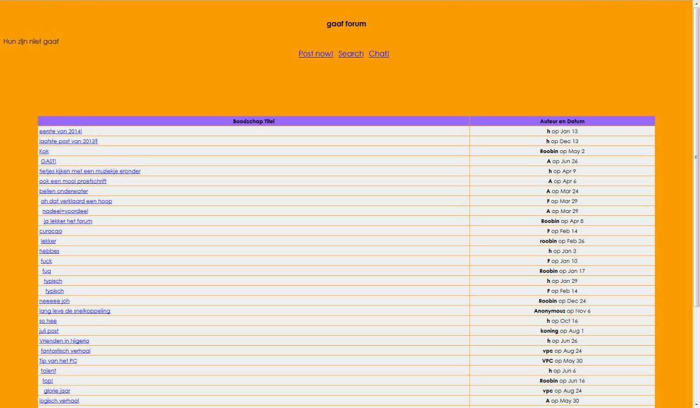
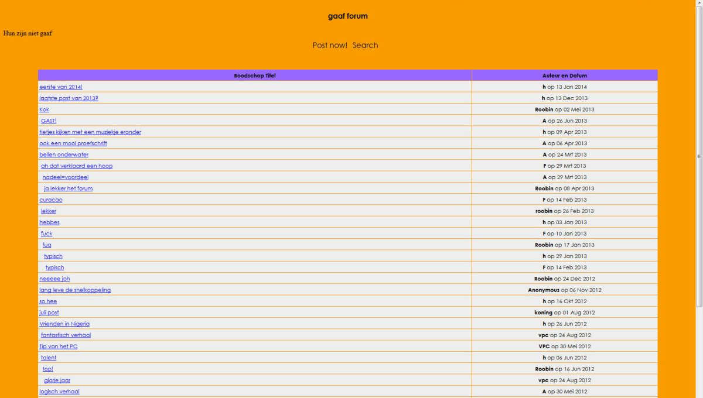

# Forum #
This is a little **private** hobby project using Scrapy and Django to rebuild the message board of 'de Prinsen'. 

*the original on [network54.com](http://www.network54.com/)*

### Objective ###
My objectives were:
* Learn how to use Scrapy and practice my Django skills
* Document this piece of 'nostalgia' in case the original host dies
* NOT to re-build full functionality (e.g. I did not re-enable posting new messages)

## Forumscrape ##
This is the scrapy project to download and store all posts in a sqlite database. I had to capture the tree structure of the forum discussions. I saved it using the [djangoitem extension](https://github.com/scrapy-plugins/scrapy-djangoitem).

I captured the forum structure into a Materialized Path tree implementation using the [django treebeard](https://pypi.python.org/pypi/django-treebeard) library. Towards the end of the scraping job I realized that adding a new root node took a long time. This slowed down running the spider considerably. I did not investigate further why this was.

## Forumreborn ##
This is the Django project which rebuilds the site. In here you also find extractfacts.py which saves some summarizing data into a pickle file.

*the rebuild*

## Forumillustrations ##
This folder contains some code to make figures for the 'facts en figures' page. Figures are created using pandas/matplotlib and the excellent [wordcloud package by amueller](https://github.com/amueller/word_cloud).

I have forked the original to add the option of transparency. Install the forked version with:

    pip install git+git://github.com/Gijsbertbas/word_cloud_transparent.git@master

### Requirements ###
I installed the following packages in my conda environment
* django==1.11.3
* django-treebeard==4.1.2
* matplotlib==2.0.2
* numpy==1.13.1
* pandas==0.20.3
* pillow==4.2.1
* python==3.5.4
* scrapy==1.3.3
* wordcloud==1.3.1 *(as described above)*
